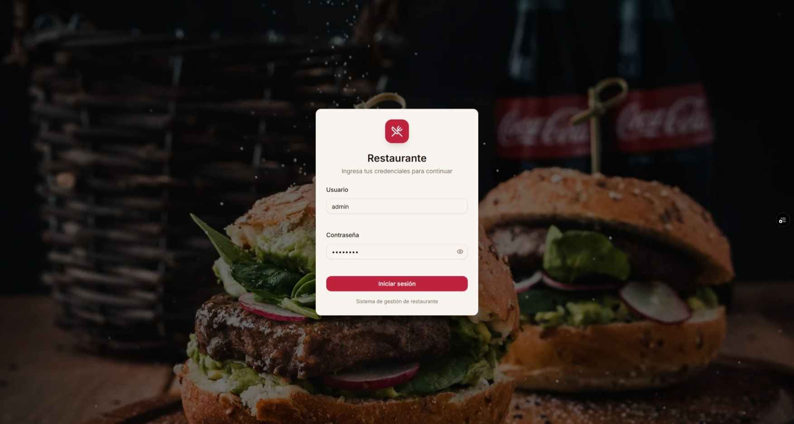
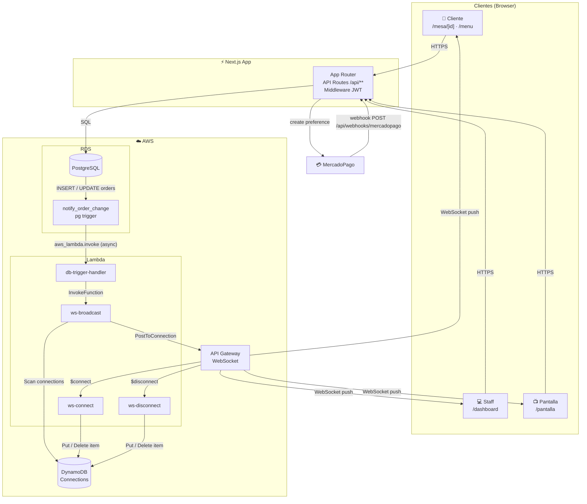

# rest-app

Sistema de gestión para restaurantes con pedidos vía QR, cocina en tiempo real y pagos integrados.



## Características

- **Clientes** escanean un QR por mesa (o un QR general) y hacen su pedido desde el celular
- **Meseros** ven y gestionan pedidos, reasignan mesas y marcan entregas
- **Cocina** recibe pedidos en pantalla en tiempo real
- **Admin** gestiona menú, usuarios, mesas, métodos de pago y crea pedidos manualmente
- **Pantalla de clientes** muestra el estado de los pedidos en el local
- **Pagos** manuales (Yape, efectivo, etc.) y con MercadoPago

## Stack

- **Next.js 16** — App Router, Server Components, API Routes
- **PostgreSQL** en AWS RDS
- **TanStack Query v5** — data fetching y mutaciones en el cliente
- **WebSockets** vía AWS API Gateway + Lambda + DynamoDB — notificaciones en tiempo real
- **MercadoPago SDK v2** — pagos con tarjeta y billetera virtual
- **Tailwind CSS v4** + componentes propios estilo shadcn

## Arquitectura



### Roles IAM

| Rol | Principal | Permisos |
|---|---|---|
| `restaurant-lambda-role` | `lambda.amazonaws.com` | CloudWatch Logs, DynamoDB full, InvokeFunction, execute-api:ManageConnections |
| `restaurant-rds-lambda-role` | `rds.amazonaws.com` | InvokeFunction → `restaurant-db-trigger` únicamente |

### Flujo en tiempo real

```
Orden INSERT/UPDATE en PostgreSQL
  → pg trigger notify_order_change()
  → aws_lambda.invoke (async, no bloquea la DB)
  → Lambda db-trigger-handler
  → Lambda ws-broadcast
  → DynamoDB: obtiene conexiones activas filtradas por rol/tableId
  → API Gateway: PostToConnection a cada cliente relevante
  → Browser: UI se actualiza sin polling
```

## Requisitos previos

- Node.js 18+, pnpm
- PostgreSQL (AWS RDS o local)
- AWS CLI configurado con perfil `default` (solo para WebSockets y notificaciones)

## Instalación

### 1. Instalar dependencias

```bash
pnpm install
```

### 2. Variables de entorno

Crea `.env.local` en la raíz:

```env
# Base de datos
DB_HOST=
DB_PORT=5432
DB_USER=
DB_PASSWORD=
DB_NAME=restaurant

# Auth
BETTER_AUTH_SECRET=cambia-esto-en-produccion-minimo-32-chars
BETTER_AUTH_URL=http://localhost:3000

# App
NEXT_PUBLIC_APP_URL=http://localhost:3000

# WebSocket (se obtiene después de correr setup-aws.sh)
NEXT_PUBLIC_WEBSOCKET_URL=
```

### 3. Base de datos

```bash
pnpm run db:setup   # Crea la DB y ejecuta el schema
pnpm run db:seed    # Inserta usuarios, mesas, menú y método de pago Yape por defecto
```

### 4. AWS (opcional — solo para notificaciones en tiempo real)

```bash
# Instalar dependencias de las Lambdas
cd infrastructure/lambda
npm install

# Crear todos los recursos AWS (DynamoDB, Lambdas, API Gateway WebSocket)
cd ../..
bash infrastructure/setup-aws.sh
```

Después del script:
1. Copia la URL del WebSocket al `.env.local` como `NEXT_PUBLIC_WEBSOCKET_URL`
2. Ejecuta el comando `aws rds add-role-to-db-instance` que imprime el script
3. Reemplaza `REPLACE_WITH_YOUR_LAMBDA_ARN` en `infrastructure/sql/triggers.sql` con el ARN de `restaurant-db-trigger` y ejecútalo en la DB

> Sin este paso la app funciona igualmente; los clientes hacen polling cada 10-15 segundos como fallback.

### 5. Correr en desarrollo

```bash
pnpm dev
```

## Usuarios por defecto

| Usuario | Contraseña | Rol |
|---|---|---|
| `admin` | `admin123` | Administrador |
| `waiter1` | `password` | Mesero |
| `chef1` | `password` | Chef |

## URLs principales

| URL | Descripción |
|---|---|
| `/login` | Acceso del staff |
| `/dashboard` | Panel de administración |
| `/mesa/[número]` | Página del cliente (por mesa) |
| `/menu` | Página del cliente (QR general, sin mesa) |
| `/pantalla` | Pantalla de estado para el local |

## MercadoPago

En el panel de admin (`/dashboard/payments`) crea un método de tipo **MercadoPago** con tu Access Token de producción. Para webhooks, configura en tu cuenta de MP la URL:

```
https://tu-dominio.com/api/webhooks/mercadopago
```

## Flujo de un pedido

```
Cliente escanea QR → hace pedido
         ↓
  [pending] → cocina acepta → [in_preparation]
         ↓
  cocina termina → [ready_to_deliver]
         ↓
  mesero entrega → [completed] → cliente paga → [paid]
```
